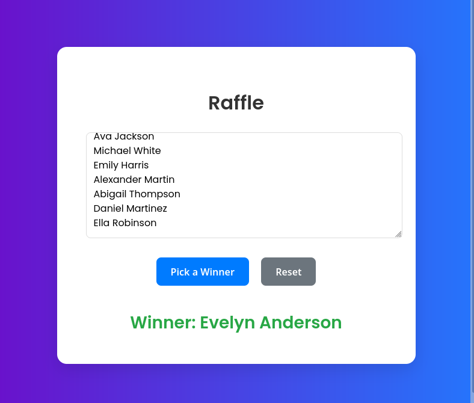
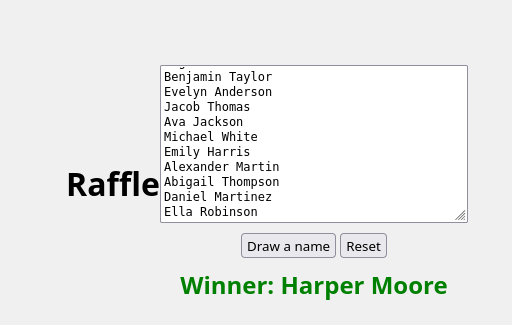

# Raffle with Gemini CLI

Gemini CLI vibe coded raffle

## First run

Was accidentally outside of the repository (forgot to step into the cloned repo folder after cloning).
The prompt was the standard "A web page which can conduct raffles from a bag of names. There's an input which takes a multi line of names from the clipboard. We need a button which randomly picks one of the names and then removes it from the list. A reset button would restore the list to its original full extent." which was given to AI Studio Builder and Lovable as well.
The spec turned out to be severely under specificed and Gemini CLI tried to write some Python code (possibly for backend), at which point we interrupted the agent and aligned it back to just a static web page. After that (and overall) the agent finished surprisingly quickly. Screenshot (was not viewed during the session):

After the realignment and realizing being outside of the repository we setepped into the repository folder and we also added to the pormpt below that the page has to be modern. "Create a static web page which can conduct raffles from a bag of names. There's an input which takes a multi line of names from the clipboard. We need a button which randomly picks one of the names and then removes it from the list. A reset button would restore the list to its original full extent.". The agent went into a longer series of steps which lasted several minutes while ti was displaying sometimes funny progress notes. The end result is badly styled (almost suggesting a missign CSS):

